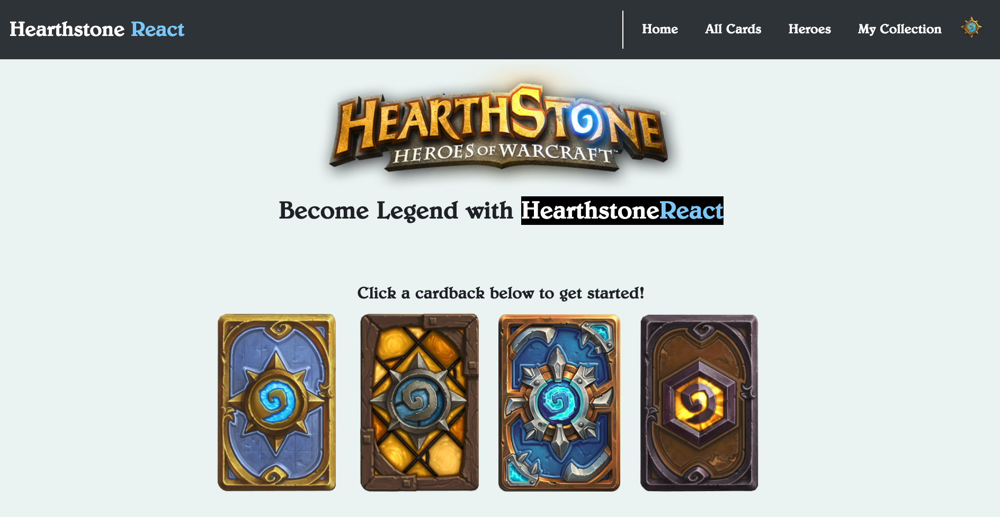

## Hearthstone React

Allow me to introduce my most recent project: Hearthstone React. To be as concise as possible, Hearthstone React is essentially a data visualization tool (built with React.js and Redux) that uses Blizzard's free api to generate "card spaces" based on the user's needs. If you've played Hearthstone before you know that there are thousands of cards in the game, but you can only choose 30 to go into your deck. This makes deck-building very challenging, especially for beginners.

(pic2)

To begin, users will narrow their search based on the information they already have. It's common to look for a card by its name, regardless of class or mana cost, so I've included the ability to search all cards no matter what cards are being displayed at the time. This will immediately re-render the page to show all cards that include what's being shown. Above you can see it show all the cards with the word "fire" in the name. This was only a week-long project, so theres still a lot of data filtration that can be done, but for now cards can only be searched by name and narrowed down by class.

(pic3)

Now let's suppose I've conveniently found the card I was looking for. Clicking on it (pictured above) will allow me to see detailed information about the individual card. First, a cropped image of the card, then the card name, followed by mana cost, attack and health. Then we get into the mathy-stuff. To start, I've calculated raw score based off of three important questions when rating a card and compared them as so:
Baseline: Does the health and attack justify the mana cost?
Effects and Synergy: Does the card have one or multiple keywords in the text? Does it have card text at all?
Rarity and its relation to text: As all Hearthstone players will know, the most important factor when playing almost any game mode is the card text. Knowing when to use it and its synergy with the rest of the deck. Does the card have text and what is its rarity?

(pic4)

Now, if you were paying close attention you may have noticed the "My Collection" tab as well as an "Add to collection" button. This is as far as I got in a week, but my goal in the near future is to bring in a user's unique collection. The user will have the ability to create a pseudo-deck and view the decks calculated raw score. In addition, there will be more math involved in calculation synergies (creature types, effects, key words, etc). If more synergies are detected, the raw score will increase.

.
.
.
.
.
.
.
.
.
.

This project was bootstrapped with [Create React App](https://github.com/facebook/create-react-app).

In the project directory, you can run:

### `npm start`

Runs the app in the development mode. 
Open [http://localhost:3000](http://localhost:3000) to view it in the browser.

The page will reload if you make edits. 
You will also see any lint errors in the console.

## Learn More

You can learn more in the [Create React App documentation](https://facebook.github.io/create-react-app/docs/getting-started).

To learn React, check out the [React documentation](https://reactjs.org/).

